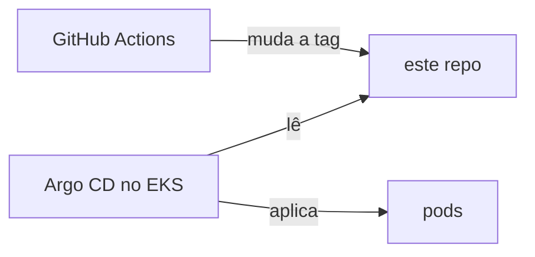

# gitops-argocd-eks

[](https://github.com/WilliamSoaresCosta/gitops-argocd-eks/actions/workflows/validate.yml)

Argo CD no EKS instalado por Terraform, lendo os manifests deste repositório.

A ideia era simples: o pipeline não deveria ter acesso ao cluster. Ele só muda a tag da imagem
no Git, e o Argo CD (que roda dentro do cluster) aplica. Ninguém roda `kubectl apply`.

Subi isso no meu laboratório e o app ficou Synced/Healthy. Escrevi como foi, com prints e os
erros que encontrei, aqui: [GitOps do zero no EKS](https://williamsoares.com/blog/gitops-do-zero-no-eks).



## Estrutura

```
terraform/argocd/     instala o Argo CD e cria os projetos e a Application raiz
gitops/clusters/dev/  ApplicationSet: um app para cada pasta em gitops/apps/
gitops/apps/api-node/ deployment, service e serviceaccount + overlay de dev
```

## Algumas escolhas

- O Argo CD fica numa stack separada da do EKS. O provider do Helm precisa do cluster pronto, e
  fazer tudo num apply só costuma dar problema no primeiro plan.
- Dois projetos no Argo CD: `plataforma` só pode criar ApplicationSets, e `apps` só lê este
  repositório e só cria coisas em namespaces `*-dev`.
- Versão dos charts fixa. Atualizo quando quero, lendo o changelog.
- Sem Load Balancer. Acesso a interface por port-forward, não gera custo e não atrapalha o destroy.
- O Helm pega o token do cluster na hora com `aws eks get-token`, sem kubeconfig salvo.
- O pod roda sem root, sem token do Kubernetes montado e com filesystem somente leitura.
- Tem um `check` que barra o plan se a credencial for de outra conta AWS.

## Como subir

Precisa de um cluster EKS já criado, aws CLI logado, Terraform 1.14+ e kubectl.

```bash
cd terraform/argocd
cp terraform.tfvars.example terraform.tfvars
cp backend.hcl.example backend.hcl

terraform init -backend-config=backend.hcl
terraform plan -out=tfplan
terraform apply tfplan
```

Interface:

```bash
kubectl -n argocd port-forward svc/argocd-server 8080:443
```

Depois de alguns segundos aparecem o `root-main` e o `api-node-dev`.

## Repositório privado

Este aqui é público, então o Argo CD lê por HTTPS. No laboratório o repositório era privado e
usei uma deploy key somente leitura. A chave privada vai direto para o cluster, não passa pelo Git
nem pelo state:

```bash
ssh-keygen -t ed25519 -N "" -C "argocd" -f ~/.ssh/argocd-gitops
# .pub em Settings > Deploy keys, com "Allow write access" desmarcado

kubectl -n argocd create secret generic repo-gitops \
  --from-literal=type=git \
  --from-literal=url=git@github.com:<dono>/<repo>.git \
  --from-file=sshPrivateKey=$HOME/.ssh/argocd-gitops
kubectl -n argocd label secret repo-gitops argocd.argoproj.io/secret-type=repository
```

## Onde eu travei

- `no such host` no kubectl: eu tinha só impresso o comando do kubeconfig, não executado.
  `aws eks update-kubeconfig --name <cluster> --region <regiao>` resolve.
- Deploy key não aparecia: a organização estava com deploy keys desabilitadas nas configurações.
- Application raiz parada em `Unknown`: ela tentou ler o repositório antes de a chave existir.
  Resolvi com refresh forçado:
  `kubectl -n argocd annotate application root-main argocd.argoproj.io/refresh=hard --overwrite`

## Próximos passos

- [ ] pipeline commitando a tag nova sozinho, usando GitHub App em vez de token pessoal
- [ ] External Secrets com Secrets Manager
- [ ] overlays de homologação e produção

A imagem usada aqui vem do [docker-node-hardened](https://github.com/WilliamSoaresCosta/docker-node-hardened).
